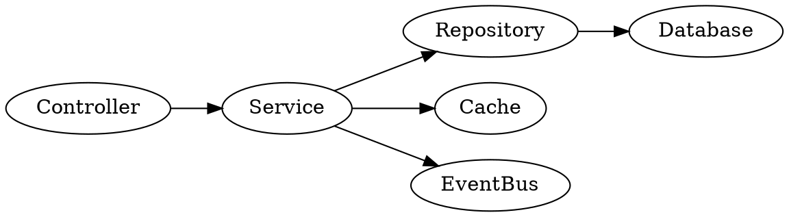
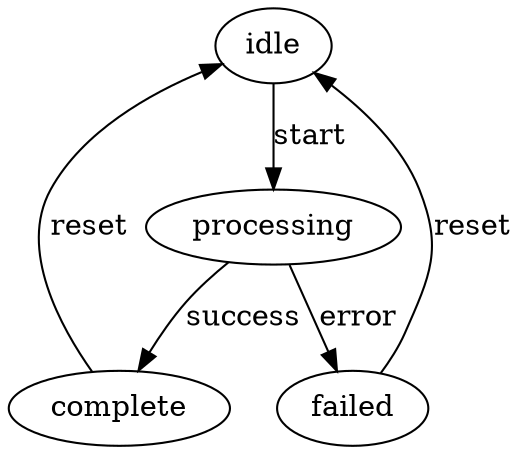
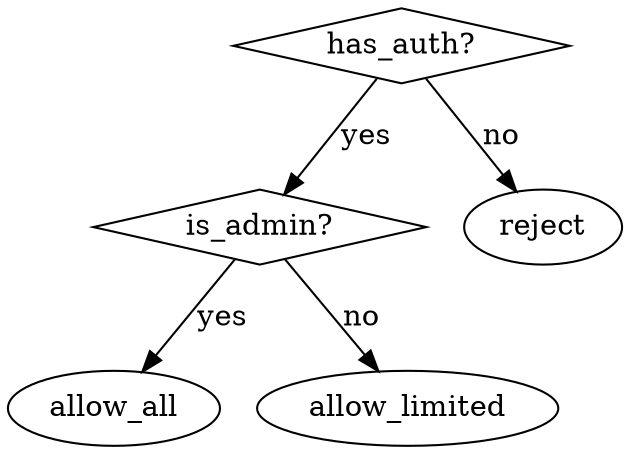

# Doc Writer for Agents

Generate documentation optimized for LLM parsing and reasoning. Documentation is an API, not prose.

## Core Principles

### P1: Documentation Is Interface

- Encode constraints and intent explicitly
- Minimize ambiguity
- Correctness over readability

### P2: Determinism Over Eloquence

- Stylistic flourish is noise (consumes tokens, adds no signal)
- Redundancy acceptable
- Repetition preferable to implication

### P3: Token Budget Awareness

Context window is finite. Every token must justify its cost:
- 100 words ≈ 130 tokens
- Prefer tables over prose
- Prefer examples over explanations
- Remove filler words

### P4: Pattern-Matching Reality

Agents pattern-match. Structure matters more than rhetoric:
- Consistent headings
- Consistent formatting
- Explicit signaling

## Bundled Resources

Load these references as needed:

| Resource | When to Load |
|----------|--------------|
| `references/patterns.md` | When generating CLAUDE.md files, rule catalogs, exemplar patterns, or complete specification documents. Contains production-grade templates and examples. |

**Pattern lookup**: For specific pattern types (transaction handling, API resilience, batch processing), search `references/patterns.md` for `PATTERN-NNN` or `EDGE-NNN`.

## Required Document Structure

Agent-oriented documents MUST be decomposable into independent, grep-able sections:

```
1. Scope & Applicability
2. Terminology (defined once, no synonyms)
3. Normative Rules (MUST/SHOULD/MAY)
4. Invariants (always true, mechanically checkable)
5. Anti-Patterns (forbidden structures)
6. Heuristics (probabilistic guidance with confidence)
7. Allowed Transformations
8. Forbidden Transformations
9. Ambiguity Resolution Order
10. Machine Checklist (binary verification)
```

Not all sections required for every document. Include only relevant sections.

## Modal Verb Semantics

Use RFC 2119 keywords consistently:

| Keyword | Meaning |
|---------|---------|
| MUST | Absolute requirement. No exceptions. |
| MUST NOT | Absolute prohibition. No exceptions. |
| SHOULD | Strong recommendation. Exceptions require justification. |
| SHOULD NOT | Strong discouragement. Exceptions require justification. |
| MAY | Optional. Agent decides. |
| UNDEFINED | Intentionally unspecified. No assumption permitted. |

Agent action: Flag violations of MUST/MUST NOT. Warn on SHOULD/SHOULD NOT violations.

## Terminology Discipline

- Define terms ONCE at document start
- NEVER use synonyms for same concept
- Disambiguate overloaded terms explicitly
- Metaphors FORBIDDEN

```markdown
## Terminology

- **entity**: A discrete data object with unique ID
- **transform**: Operation that modifies entity state
- **invariant**: Condition that must hold before and after every transform
```

## Normative Rule Format

Rules MUST be atomic and structured:

```markdown
### RULE-001: [Descriptive Name]

**Rule**: [Single constraint statement]

**Applies to**: [Explicit scope]

**Rationale**: [Why this exists]

**Violation consequence**: [What breaks]

**Agent action**: Flag | Auto-fix allowed | Auto-fix forbidden | Defer to human
```

Example:

```markdown
### RULE-001: No Null Returns from Finders

**Rule**: Functions named `find-*` MUST return empty collection, not null.

**Applies to**: All public API functions matching `find-*` pattern.

**Rationale**: Callers can always iterate result without null-checking.

**Violation consequence**: NullPointerException in caller code.

**Agent action**: Auto-fix allowed (replace null return with empty collection).
```

## Invariant Specification

Invariants MUST be:
- Always true (before, during, after operations)
- Mechanically checkable
- Higher precedence than all other guidance

```markdown
## Invariants

### INV-001: ID Uniqueness
`∀ entity: entity.id is unique within collection`
Check: `(= (length entities) (length (remove-duplicates entities :key #'id)))`

### INV-002: Non-negative Balance
`∀ account: account.balance >= 0`
Check: `(every #'(lambda (a) (>= (balance a) 0)) accounts)`
```

## Exemplar Patterns (Critical)

Rules prevent bugs. Patterns enable fluency. **Both are required.**

An agent with only rules writes code that's "mechanically correct but operationally awkward" - like having legal code without case law.

### Pattern Format

```markdown
### PATTERN-NNN: [Descriptive Name]

**Scenario**: [Concrete situation requiring this pattern]

**Complete Example**:
```language
;; Full, runnable code - not fragments
;; Inline comments explain WHY, not WHAT
(defun real-workflow (args)
  ;; Setup phase - note the ordering matters because [reason]
  (with-resource (r (acquire-resource args))
    ;; Core operation - using X instead of Y because [rule reference]
    (let ((result (process r)))
      ;; Recovery pattern - this shape handles [edge case]
      (handler-case 
          (commit result)
        (transient-error (e)
          ;; Retry is safe here because [invariant reference]
          (retry-with-backoff #'commit result))))))
```

**Rules Satisfied**: R001, R007, R012

**Why This Shape**:
- [Design decision 1 and rationale]
- [Design decision 2 and rationale]

**Variations**:
| Scenario | Modification |
|----------|--------------|
| Batch processing | Wrap in `do-batch`, accumulate errors |
| Streaming | Replace `commit` with `emit`, no retry |

**Anti-pattern**:
```language
;; DON'T do this
(process (acquire-resource args))  ; Resource leak - violates R007
```
```

### Required Pattern Categories

For any non-trivial library/system, include patterns for:

| Category | Purpose | Example |
|----------|---------|---------|
| **Happy path** | Typical successful operation | CRUD workflow |
| **Error recovery** | Handling failures idiomatically | Retry, fallback, cleanup |
| **Composition** | Threading operations together | Transaction + validation + logging |
| **Resource lifecycle** | Acquire/use/release | Connection pools, file handles |
| **Edge cases** | Non-obvious scenarios | Empty input, concurrent access, timeout |

### Pattern Density Guideline

| Document Complexity | Minimum Patterns |
|---------------------|------------------|
| Simple API (<10 functions) | 2-3 |
| Medium library (10-30 functions) | 5-8 |
| Complex system (>30 functions) | 10-15 |

Rule of thumb: **One pattern per major "shape" of operation**.

### Connecting Patterns to Rules

Every pattern SHOULD reference the rules it satisfies:

```markdown
**Rules Satisfied**: R001 (null safety), R007 (resource cleanup), R012 (error propagation)
```

This creates bidirectional navigation:
- Reading rules → "What must I avoid?"
- Reading patterns → "What should I do?"
- Pattern references rules → "Why this specific shape?"

### Edge Case Narratives

Don't just list edge cases - show the story:

```markdown
### EDGE-001: BUSY Under Concurrent Load

**Scenario**: Multiple writers hit the database simultaneously.

**What happens**:
1. Writer A begins transaction
2. Writer B attempts write → receives BUSY
3. Writer B's naive retry loop spins for 5 seconds
4. Writer A commits → Writer B succeeds on retry 847

**Idiomatic handling**:
```language
;; Exponential backoff with jitter - not tight retry loop
(with-retry (:max-attempts 5 :backoff :exponential :jitter 0.1)
  (execute-write db statement))
```

**Why not**:
- Tight loop: Burns CPU, extends lock contention
- Fixed delay: Synchronized retries cause thundering herd
- No max attempts: Infinite loop on persistent failure
```

## Anti-Pattern Specification

Anti-patterns describe forbidden emergent structures:

```markdown
## Anti-Patterns

### ANTI-001: God Object

**Description**: Single class with >20 public methods spanning multiple domains.

**Symptoms**: 
- File >1000 LOC
- Imports from >10 unrelated modules
- Method names span multiple concepts

**Why harmful**: Untestable, unmaintainable, violates SRP.

**Remediation**: Extract domain-specific classes.

**Agent action**: Flag for human review. Auto-fix forbidden.
```

## Heuristics Specification

Heuristics are probabilistic. MUST include confidence:

```markdown
## Heuristics

### HEUR-001: Long Function Smell

**Signal**: Function >50 LOC
**Confidence**: Medium (70%)
**Interpretation**: Likely needs extraction
**Action**: Yellow flag. Suggest refactoring, don't auto-apply.

### HEUR-002: Plural Variable Is Collection

**Signal**: Variable named with plural noun
**Confidence**: High (90%)
**Interpretation**: Expect iterable type
**Action**: Green signal. Use for type inference.
```

Signal levels:
- **Red flag**: High confidence problem. Requires attention.
- **Yellow flag**: Potential issue. Warrants review.
- **Green signal**: Positive indicator. Continue.

## Transformation Specification

### Allowed Transformations

Explicitly list what agents MAY change:

```markdown
## Allowed Transformations

| Transform | Scope | Conditions |
|-----------|-------|------------|
| Rename local variable | Function body | No shadowing, consistent rename |
| Extract method | Function body | Preserves behavior, updates all call sites |
| Add type annotation | Parameters, returns | Compatible with existing usage |
```

### Forbidden Transformations

Explicitly list what agents MUST NOT change:

```markdown
## Forbidden Transformations

| Transform | Reason |
|-----------|--------|
| Modify public API signature | Breaking change |
| Remove error handling | Safety regression |
| Change concurrency primitives | Race condition risk |
```

**Absence from both lists**: Human approval required.

## Ambiguity Resolution

Precedence order (highest first):

1. Invariants
2. Normative rules (MUST)
3. Explicit documentation
4. Existing public API contract
5. Heuristics

If ambiguity remains after applying precedence:
**Agent MUST defer to human input.**

## Machine Checklist Format

Provide binary, verifiable assertions:

```markdown
## Machine Checklist

```
[ ] All invariants satisfied
[ ] Zero MUST violations
[ ] Zero forbidden transformations applied
[ ] All SHOULD violations justified in comments
[ ] Test suite passes
```
```

## Dense Notation Formats

Prefer formal notations over prose for structured information. Agents parse these reliably.

### DOT Graphs

Use for: dependencies, state machines, control flow, decision trees.



Equivalent prose would require 40+ words. DOT is unambiguous and parseable.

**State machines:**


**Decision trees:**


### BNF/EBNF Grammars

Use for: syntax specifications, input formats, DSLs.

```ebnf
config      ::= section+
section     ::= '[' identifier ']' newline entry*
entry       ::= key '=' value newline
key         ::= identifier
value       ::= string | number | boolean
identifier  ::= [a-zA-Z_][a-zA-Z0-9_]*
```

### Regex Patterns

Use for: validation rules, input constraints.

```markdown
| Field | Pattern | Description |
|-------|---------|-------------|
| email | `^[^@]+@[^@]+\.[^@]+$` | Basic email format |
| slug | `^[a-z0-9]+(?:-[a-z0-9]+)*$` | URL-safe identifier |
| semver | `^\d+\.\d+\.\d+(?:-[\w.]+)?$` | Semantic version |
```

### Truth Tables

Use for: complex conditional logic, permission matrices.

```markdown
| authenticated | is_owner | is_admin | can_edit |
|---------------|----------|----------|----------|
| F | - | - | F |
| T | F | F | F |
| T | T | F | T |
| T | F | T | T |
| T | T | T | T |
```

Equivalent prose: "Users can edit if authenticated AND (owner OR admin)."
Truth table is verifiable; prose requires interpretation.

### Matrix Notation

Use for: role-permission mappings, feature flags, compatibility.

```markdown
## Permission Matrix

|  | read | write | delete | admin |
|--|------|-------|--------|-------|
| guest | ✓ | - | - | - |
| user | ✓ | ✓ | - | - |
| editor | ✓ | ✓ | ✓ | - |
| admin | ✓ | ✓ | ✓ | ✓ |
```

### Set Notation

Use for: constraints, invariants, type bounds.

```markdown
## Type Constraints

- `input ∈ {string, number, boolean}`
- `status ∈ {pending, active, completed, failed}`
- `0 ≤ priority ≤ 10`
- `timeout ∈ ℕ, timeout ≤ 300`
```

### Precedence Notation

Use for: operator precedence, rule ordering.

```markdown
## Resolution Precedence (highest first)

1. Invariants
2. MUST rules
3. SHOULD rules  
4. Explicit documentation
5. Heuristics

Or compactly: `Invariants > MUST > SHOULD > Docs > Heuristics`
```

### When to Use Dense Notation

| Information Type | Notation | Token Savings |
|------------------|----------|---------------|
| Dependencies | DOT digraph | 3-5x |
| State transitions | DOT FSM | 4-6x |
| Syntax rules | BNF/EBNF | 2-4x |
| Validation | Regex | 3-5x |
| Conditionals | Truth table | 2-3x |
| Permissions | Matrix | 3-4x |
| Constraints | Set notation | 2-3x |

Prefer dense notation when:
- Relationships are structural (graphs, trees)
- Logic is combinatorial (truth tables)
- Patterns are mechanical (regex, BNF)
- Mappings are tabular (matrices)

Use prose when:
- Explaining rationale (why, not what)
- Context is ambiguous
- Human review is primary audience

## Chunking Strategy for RAG

When documents exceed context limits, design for retrieval:

- Each section standalone (no forward references)
- Headers contain keywords for semantic search
- First paragraph of each section summarizes content
- Use consistent anchor patterns: `## RULE-NNN:`, `## INV-NNN:`

## Structured Output Patterns

### YAML Frontmatter

```yaml
---
type: specification
version: 1.0.0
applies-to: [module-a, module-b]
requires: [prerequisite-doc]
supersedes: [old-doc]
---
```

### JSON Schema Embedding

When documenting data structures, include parseable schema:

```markdown
## Entity Schema

```json
{
  "$schema": "http://json-schema.org/draft-07/schema#",
  "type": "object",
  "required": ["id", "name"],
  "properties": {
    "id": {"type": "string", "pattern": "^[a-z0-9-]+$"},
    "name": {"type": "string", "minLength": 1}
  }
}
```
```

## Forbidden Content

MUST NOT include:
- Storytelling
- Motivational language
- Historical narrative
- Implicit assumptions
- Softening language ("perhaps", "might want to")
- Humor or personality

These consume tokens without adding actionable information.

## Token Efficiency Techniques

### Prefer Tables

Prose (42 words):
> The function accepts a filename parameter which should be a string, an optional encoding parameter which defaults to UTF-8, and returns either the file contents as a string or nil if the file doesn't exist.

Table (equivalent, 15 words):

| Param | Type | Default | Description |
|-------|------|---------|-------------|
| filename | string | required | Path to file |
| encoding | string | "UTF-8" | File encoding |
| **Returns** | string \| nil | | Contents or nil |

### Prefer Examples Over Explanation

Explanation (30 words):
> To configure logging, create a configuration object with the level set to the desired verbosity, the format set to your preferred output pattern, and the destination set to the output stream.

Example (equivalent, 8 words + code):

```lisp
(make-log-config :level :debug
                 :format "[~a] ~a"
                 :dest *standard-output*)
```

## Integration with Other Skills

This skill produces documentation consumed by:
- `cl-library-designer`: Library specs
- `elisp-analyzer`: Analysis rule sets
- Claude Code CLAUDE.md files

When generating skill documentation:
1. Follow SKILL.md format from skill-creator
2. Description field is primary trigger (make comprehensive)
3. Body loads after trigger (no "when to use" in body)

## Validation Questions

Before emitting agent documentation:

- [ ] Can every rule be enforced mechanically?
- [ ] Are constraints distinguishable from advice?
- [ ] Is anything implied but unstated?
- [ ] Are unsafe transformations explicitly forbidden?
- [ ] Does every section justify its token cost?
- [ ] Are all terms defined exactly once?

## Output Format

Produce `.md` files with structured sections. For complex specifications, split into:
- `SPEC.md`: Core rules and invariants
- `RULES.md`: Detailed rule catalog
- `CHECKLIST.md`: Verification assertions

When finished, summarize:
1. Documents created
2. Rule/invariant counts
3. Any ambiguities requiring human input
