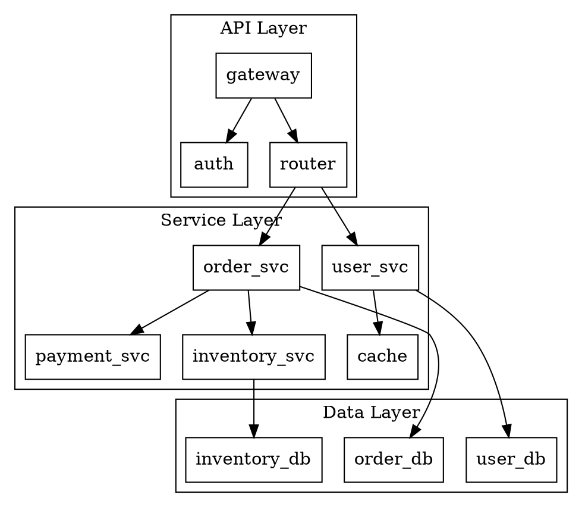
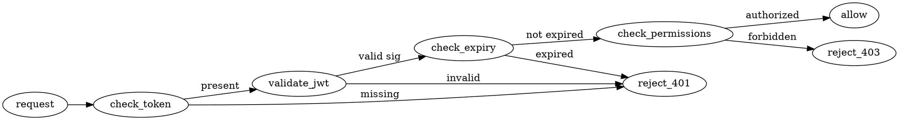
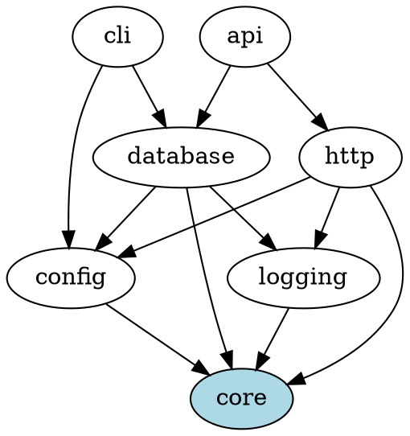
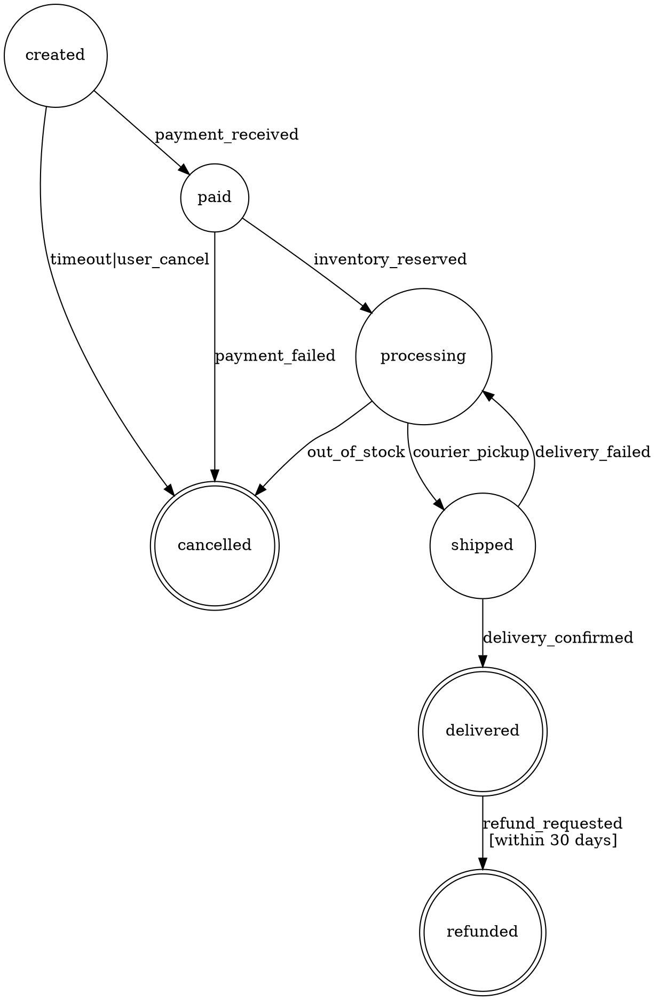
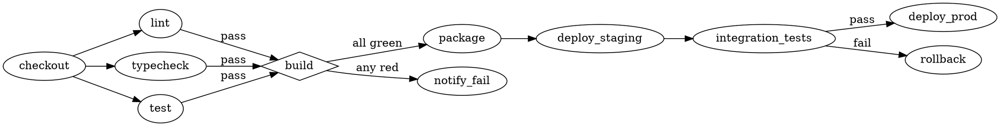
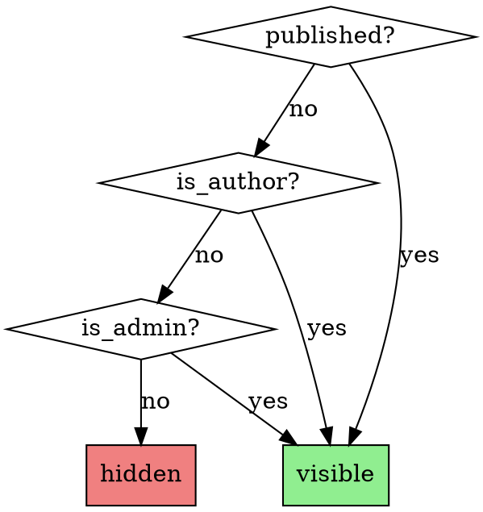

# Agent Documentation Patterns Reference

Detailed patterns for agent-consumable documentation. Load when generating complex specifications.

## Exemplar Pattern Examples

### Database Transaction Patterns

```markdown
## Patterns

### PATTERN-001: Simple Read-Modify-Write

**Scenario**: Update a single record with optimistic concurrency.

**Complete Example**:
```python
def update_user_email(db: Database, user_id: str, new_email: str) -> User:
    """
    Full workflow showing transaction + validation + error recovery.
    This is THE shape for single-record mutations.
    """
    with db.transaction() as tx:
        # 1. Read current state (SELECT FOR UPDATE for consistency)
        user = tx.query_one(
            "SELECT * FROM users WHERE id = ? FOR UPDATE",
            [user_id]
        )
        if user is None:
            raise NotFoundError(f"User {user_id} not found")
        
        # 2. Validate business rules BEFORE mutation
        if not is_valid_email(new_email):
            raise ValidationError("Invalid email format")
        if tx.query_one("SELECT 1 FROM users WHERE email = ?", [new_email]):
            raise ConflictError("Email already in use")
        
        # 3. Mutate
        tx.execute(
            "UPDATE users SET email = ?, updated_at = NOW() WHERE id = ?",
            [new_email, user_id]
        )
        
        # 4. Return fresh state (proves write succeeded)
        return tx.query_one("SELECT * FROM users WHERE id = ?", [user_id])
    # Transaction auto-commits on exit, auto-rollbacks on exception

# Usage:
try:
    user = update_user_email(db, "user-123", "new@example.com")
except NotFoundError:
    return 404, "User not found"
except ValidationError as e:
    return 400, str(e)
except ConflictError:
    return 409, "Email already exists"
except DatabaseError:
    # Don't expose internal errors
    log.exception("Database error in update_user_email")
    return 500, "Internal error"
```

**Rules Satisfied**: R003 (transaction boundaries), R007 (validation before mutation), R011 (error specificity), R015 (no leaked internals)

**Why This Shape**:
- FOR UPDATE prevents concurrent modification during our read-modify cycle
- Validation inside transaction ensures consistent view
- Fresh read after write proves success and returns current state
- Exception types map cleanly to HTTP status codes

**Variations**:
| Scenario | Modification |
|----------|--------------|
| Bulk update | Use `executemany`, accumulate errors, partial success |
| Async | `async with db.transaction()`, same shape otherwise |
| Retry on conflict | Wrap entire function in retry decorator |

**Anti-pattern**:
```python
# DON'T: Read outside transaction, write inside
user = db.query_one("SELECT * FROM users WHERE id = ?", [user_id])  # No lock!
with db.transaction() as tx:
    tx.execute("UPDATE users SET email = ?", [new_email])  # Race condition!
```
```

### PATTERN-002: Batch Processing with Partial Failure

**Scenario**: Process multiple items where some may fail independently.

**Complete Example**:
```python
@dataclass
class BatchResult:
    succeeded: list[str]
    failed: dict[str, str]  # id -> error message

def process_batch(db: Database, items: list[Item]) -> BatchResult:
    """
    Process items individually, collect all results.
    Never let one failure abort the entire batch.
    """
    result = BatchResult(succeeded=[], failed={})
    
    for item in items:
        try:
            # Each item gets its own transaction
            with db.transaction() as tx:
                process_single(tx, item)
            result.succeeded.append(item.id)
        except ValidationError as e:
            # Expected failure - record and continue
            result.failed[item.id] = f"Validation: {e}"
        except DatabaseError as e:
            # Unexpected but recoverable - record and continue
            log.warning(f"DB error processing {item.id}: {e}")
            result.failed[item.id] = "Database error"
        # Note: we don't catch Exception - let unexpected errors bubble
    
    return result

# Usage:
result = process_batch(db, items)
log.info(f"Processed {len(result.succeeded)}/{len(items)}, "
         f"{len(result.failed)} failures")
if result.failed:
    for item_id, error in result.failed.items():
        log.warning(f"  {item_id}: {error}")
```

**Rules Satisfied**: R009 (isolated failures), R014 (comprehensive logging), R018 (partial success reporting)

**Why This Shape**:
- Per-item transactions prevent one bad item from rolling back good ones
- Structured result type makes success/failure explicit
- Separate handling for expected vs unexpected errors
- Caller decides policy (retry failures? alert? ignore?)

**Variations**:
| Scenario | Modification |
|----------|--------------|
| All-or-nothing | Single transaction, raise on first error |
| Streaming input | Generator-based, yield results incrementally |
| Parallel | `ThreadPoolExecutor`, but watch connection pool exhaustion |
```

### PATTERN-003: Resource Cleanup Under Error

**Scenario**: Acquire multiple resources, clean up correctly if any step fails.

**Complete Example**:
```python
def transfer_with_audit(
    db: Database,
    from_account: str,
    to_account: str,
    amount: Decimal,
    audit_file: Path
) -> TransferResult:
    """
    Multi-resource operation: database + file + external service.
    Each resource has cleanup requirements.
    """
    audit_handle = None
    notification_sent = False
    
    try:
        # 1. Acquire file handle (cleanup: close)
        audit_handle = audit_file.open('a')
        
        # 2. Database transaction (cleanup: auto-rollback)
        with db.transaction() as tx:
            # Verify sufficient funds
            balance = tx.query_one(
                "SELECT balance FROM accounts WHERE id = ? FOR UPDATE",
                [from_account]
            ).balance
            
            if balance < amount:
                raise InsufficientFundsError(balance, amount)
            
            # Perform transfer
            tx.execute(
                "UPDATE accounts SET balance = balance - ? WHERE id = ?",
                [amount, from_account]
            )
            tx.execute(
                "UPDATE accounts SET balance = balance + ? WHERE id = ?",
                [amount, to_account]
            )
            
            # Record in audit log (inside transaction for consistency)
            transfer_id = tx.query_one(
                "INSERT INTO transfers (from_acc, to_acc, amount) "
                "VALUES (?, ?, ?) RETURNING id",
                [from_account, to_account, amount]
            ).id
            
            # 3. External notification (cleanup: compensating action)
            notify_transfer(from_account, to_account, amount)
            notification_sent = True
            
            # Write to audit file AFTER db commit succeeds
            # (transaction commits here on context exit)
        
        # 4. File write after successful commit
        audit_handle.write(
            f"{datetime.now().isoformat()},{transfer_id},{amount}\n"
        )
        audit_handle.flush()
        
        return TransferResult(transfer_id=transfer_id, status="completed")
        
    except InsufficientFundsError:
        raise  # Let caller handle business error
    except Exception as e:
        # Compensate for any partial work
        if notification_sent:
            try:
                cancel_notification(from_account, to_account, amount)
            except Exception:
                log.error("Failed to cancel notification - manual cleanup needed")
        raise TransferError(f"Transfer failed: {e}") from e
    finally:
        # Always close file handle
        if audit_handle:
            audit_handle.close()
```

**Rules Satisfied**: R005 (resource cleanup), R008 (compensation), R012 (error chaining), R021 (audit trail)

**Why This Shape**:
- Resources acquired in order of cleanup difficulty (file < db < external)
- Each resource type has appropriate cleanup mechanism
- Compensating action for external side effects
- Audit write happens AFTER commit (never audit failed transfers)
- `finally` guarantees file closure
- Original exception preserved via `from e`
```

### API Client Patterns

```markdown
### PATTERN-004: Resilient External API Call

**Scenario**: Call external API with retry, timeout, and circuit breaking.

**Complete Example**:
```python
class ResilientClient:
    def __init__(self, base_url: str):
        self.base_url = base_url
        self.circuit_open = False
        self.failure_count = 0
        self.last_failure_time = None
    
    def call(self, endpoint: str, payload: dict) -> dict:
        """
        External API call with:
        - Timeout (don't wait forever)
        - Retry with backoff (handle transient failures)
        - Circuit breaker (fail fast when service is down)
        """
        if self._circuit_is_open():
            raise CircuitOpenError("Service unavailable, try later")
        
        last_error = None
        for attempt in range(3):
            try:
                response = requests.post(
                    f"{self.base_url}/{endpoint}",
                    json=payload,
                    timeout=(3, 10),  # (connect, read) timeouts
                )
                response.raise_for_status()
                self._record_success()
                return response.json()
                
            except requests.Timeout as e:
                last_error = e
                # Timeout: always retry with backoff
                self._wait_backoff(attempt)
                
            except requests.HTTPError as e:
                if e.response.status_code >= 500:
                    # Server error: retry
                    last_error = e
                    self._wait_backoff(attempt)
                elif e.response.status_code == 429:
                    # Rate limited: retry with longer backoff
                    last_error = e
                    self._wait_backoff(attempt, multiplier=2)
                else:
                    # Client error (4xx): don't retry, it won't help
                    raise ClientError(e.response.status_code, e.response.text)
                    
            except requests.ConnectionError as e:
                last_error = e
                self._wait_backoff(attempt)
        
        # All retries exhausted
        self._record_failure()
        raise ServiceUnavailableError(f"Failed after 3 attempts: {last_error}")
    
    def _wait_backoff(self, attempt: int, multiplier: float = 1.0):
        """Exponential backoff with jitter."""
        base_delay = 0.5 * (2 ** attempt) * multiplier
        jitter = random.uniform(0, 0.1 * base_delay)
        time.sleep(base_delay + jitter)
    
    def _circuit_is_open(self) -> bool:
        """Check if circuit breaker is tripped."""
        if not self.circuit_open:
            return False
        # Allow retry after 30 seconds
        if time.time() - self.last_failure_time > 30:
            self.circuit_open = False
            return False
        return True
    
    def _record_success(self):
        self.failure_count = 0
        self.circuit_open = False
    
    def _record_failure(self):
        self.failure_count += 1
        self.last_failure_time = time.time()
        if self.failure_count >= 5:
            self.circuit_open = True

# Usage:
client = ResilientClient("https://api.example.com")
try:
    result = client.call("process", {"data": "value"})
except CircuitOpenError:
    # Service is known to be down - use cached/default value
    result = get_cached_default()
except ClientError as e:
    # Our request is bad - fix the payload
    log.error(f"Bad request: {e}")
    raise
except ServiceUnavailableError:
    # Service is struggling - alert and degrade gracefully
    alert_ops("External API unavailable")
    result = get_degraded_response()
```

**Rules Satisfied**: R010 (timeout required), R016 (retry classification), R019 (circuit breaker), R023 (graceful degradation)

**Why This Shape**:
- Tuple timeout: separate connect vs read (fast fail on unreachable, patient on slow)
- Error classification: 4xx never retried, 5xx/timeout always retried
- Jitter prevents thundering herd on recovery
- Circuit breaker prevents cascade failures
- Caller decides degradation strategy
```

### EDGE-001: Concurrent Modification

```markdown
### EDGE-001: Lost Update Under Concurrent Writes

**Scenario**: Two users edit the same record simultaneously.

**What happens without protection**:
```
T=0: User A reads balance=100
T=1: User B reads balance=100
T=2: User A writes balance=150 (added 50)
T=3: User B writes balance=80 (subtracted 20)
Result: balance=80, User A's +50 is lost
```

**Idiomatic prevention - Optimistic Locking**:
```python
def update_with_version(db, record_id: str, mutation: Callable, max_retries: int = 3):
    """
    Optimistic concurrency: read version, write with version check.
    Retry on conflict rather than blocking.
    """
    for attempt in range(max_retries):
        # Read current state with version
        record = db.query_one(
            "SELECT *, version FROM records WHERE id = ?",
            [record_id]
        )
        
        # Apply mutation to get new state
        new_state = mutation(record)
        
        # Write only if version unchanged
        rows_affected = db.execute(
            "UPDATE records SET data = ?, version = version + 1 "
            "WHERE id = ? AND version = ?",
            [new_state, record_id, record.version]
        )
        
        if rows_affected == 1:
            return new_state  # Success
        
        # Version changed - someone else wrote first
        if attempt < max_retries - 1:
            # Brief random delay to desynchronize retries
            time.sleep(random.uniform(0.01, 0.05))
            continue
    
    raise ConcurrentModificationError(
        f"Record {record_id} modified by another process"
    )

# Usage:
def add_fifty(record):
    record.balance += 50
    return record

update_with_version(db, "account-123", add_fifty)
```

**Why optimistic over pessimistic (SELECT FOR UPDATE)**:
- No lock held during user think time
- Better throughput when conflicts are rare
- Explicit conflict detection (no silent overwrites)

**When to use pessimistic instead**:
- Very high contention (conflicts common)
- Critical section must not retry (side effects)
- Short transactions only (don't hold locks long)
```

## CLAUDE.md Template

For project-level agent instructions:

```markdown
# CLAUDE.md

## Project Context

**Name**: project-name
**Language**: Python 3.11
**Framework**: FastAPI
**Test Runner**: pytest

## Build Commands

```bash
# Install
pip install -e ".[dev]"

# Test
pytest -v

# Lint
ruff check .

# Type check
mypy src/
```

## Code Conventions

### Naming

| Entity | Pattern | Example |
|--------|---------|---------|
| Module | snake_case | `user_service.py` |
| Class | PascalCase | `UserService` |
| Function | snake_case | `get_user_by_id` |
| Constant | UPPER_SNAKE | `MAX_RETRIES` |

### Imports

Order: stdlib → third-party → local
Absolute imports only.

### Error Handling

- Use custom exceptions from `src/exceptions.py`
- Never catch bare `Exception`
- Always log before re-raising

## Architecture Rules

### RULE: Service Layer Boundary

**Rule**: Controllers MUST NOT access repositories directly.

**Correct**:
```python
class UserController:
    def __init__(self, user_service: UserService):
        self.service = user_service
    
    def get(self, id: str):
        return self.service.get_by_id(id)
```

**Violation**:
```python
class UserController:
    def __init__(self, user_repo: UserRepository):  # WRONG
        self.repo = user_repo
```

## File Locations

| Type | Location |
|------|----------|
| Source | `src/` |
| Tests | `tests/` |
| Config | `config/` |
| Migrations | `migrations/` |

## Invariants

- [ ] All public functions have type hints
- [ ] All public functions have docstrings
- [ ] No circular imports
- [ ] Test coverage >80%
```

## SKILL.md Patterns

### Minimal Skill

```markdown
---
name: skill-name
description: One-line description. Triggers on "keyword", "another keyword".
---

# Skill Name

## Quick Reference

```bash
command-to-run
```

## Rules

### RULE-001: Name

**Rule**: Constraint.
**Action**: Flag | Auto-fix | Defer.
```

### Skill with References

```markdown
---
name: complex-skill
description: Comprehensive description covering all trigger scenarios.
---

# Complex Skill

## Overview

[2-3 sentences max]

## Decision Tree

```
User request
├─ Scenario A → Use pattern-a.md
├─ Scenario B → Use pattern-b.md
└─ Ambiguous → Ask for clarification
```

## Core Rules

[Only the 3-5 most critical rules here]

## Detailed Patterns

For specific patterns, see:
- `references/pattern-a.md`: When [condition A]
- `references/pattern-b.md`: When [condition B]
- `references/edge-cases.md`: Unusual situations

## Machine Checklist

```
[ ] Scenario identified
[ ] Correct pattern selected
[ ] All MUST rules satisfied
```
```

## Rule Catalog Format

For extensive rule sets, use separate file:

```markdown
# Rule Catalog

## Index

| ID | Name | Severity |
|----|------|----------|
| R001 | No null returns | MUST |
| R002 | Prefer composition | SHOULD |
| R003 | Document public API | SHOULD |

## Rules

### R001: No Null Returns

**Severity**: MUST
**Applies to**: All public functions
**Rule**: Return empty collection, not null
**Rationale**: Eliminates null checks in callers
**Detection**: Return statement with `null`/`nil`/`None`
**Auto-fix**: Replace with `[]`/`{}`/`()` as appropriate

### R002: Prefer Composition

**Severity**: SHOULD
**Applies to**: Class design
**Rule**: Favor composition over inheritance
**Rationale**: More flexible, easier to test
**Detection**: Inheritance depth >2
**Auto-fix**: Forbidden (requires design decision)

[...]
```

## Transformation Catalog Format

```markdown
# Allowed Transformations

## T001: Rename Local Variable

**Scope**: Within function body
**Preconditions**:
- Variable is not parameter
- New name doesn't shadow outer scope
- New name follows naming conventions

**Algorithm**:
1. Find all references to variable in scope
2. Verify no shadowing
3. Replace all references

**Post-conditions**:
- All references updated
- No shadowing introduced
- Behavior preserved

**Rollback**: Revert all renames

---

## T002: Extract Method

**Scope**: Contiguous code block
**Preconditions**:
- Selected code has single entry point
- Selected code has identifiable outputs
- No non-local control flow (return, break affecting outer scope)

**Algorithm**:
1. Identify inputs (variables read, not defined in selection)
2. Identify outputs (variables defined, used after selection)
3. Create function with inputs as parameters
4. Return outputs (or modify in place if reference)
5. Replace selection with function call

**Post-conditions**:
- Original behavior preserved
- New function is testable in isolation

**Rollback**: Inline the extracted function
```

## Invariant Verification Patterns

```markdown
# Invariants

## Static Invariants (Checkable at Parse Time)

### S-INV-001: File Naming

**Assertion**: `∀ file in src/: file.name matches /^[a-z][a-z0-9_]*\.py$/`
**Check**: `find src/ -name "*.py" | grep -v '^[a-z][a-z0-9_]*\.py$'`
**Empty output**: Pass

### S-INV-002: No Print Statements

**Assertion**: `∀ file in src/: file contains no `print()` calls`
**Check**: `grep -r "print(" src/`
**Empty output**: Pass

## Runtime Invariants (Checkable via Tests)

### R-INV-001: Balance Non-Negative

**Assertion**: `∀ account: account.balance >= 0 after any operation`
**Test pattern**:
```python
@pytest.fixture
def account():
    return Account(balance=100)

def test_withdrawal_maintains_invariant(account):
    account.withdraw(50)
    assert account.balance >= 0

def test_withdrawal_rejects_overdraft(account):
    with pytest.raises(InsufficientFunds):
        account.withdraw(200)
    assert account.balance >= 0  # Still valid
```
```

## Confidence Calibration

When specifying heuristic confidence:

| Confidence | Meaning | False Positive Rate |
|------------|---------|---------------------|
| Very High (95%+) | Almost always true | <5% |
| High (80-94%) | Usually true | 5-20% |
| Medium (60-79%) | Often true | 20-40% |
| Low (40-59%) | Sometimes true | 40-60% |

Agents SHOULD NOT auto-act on Low confidence heuristics.

## Error Message Documentation

For agent-parseable error handling:

```markdown
## Error Catalog

### ERR-001: Invalid Configuration

**Code**: `CONFIG_INVALID`
**HTTP Status**: 400
**Cause**: Configuration file malformed or missing required fields
**Required fields**: `database.host`, `database.port`, `api.key`

**Agent response**:
1. Parse error message for missing field name
2. Check config file exists
3. Validate against schema
4. Report specific missing/invalid field

**User-facing message template**:
```
Configuration error: {field} is {issue}.
Expected: {expected}
Got: {actual}
```

### ERR-002: Connection Timeout

**Code**: `CONN_TIMEOUT`
**HTTP Status**: 504
**Cause**: Downstream service did not respond within timeout

**Agent response**:
1. Check `TIMEOUT` environment variable
2. Verify downstream service health
3. Suggest increasing timeout if service is slow but healthy
```

## Spec Versioning Pattern

```markdown
---
spec-version: 2.1.0
min-compatible-version: 2.0.0
breaking-changes-from: 1.x
---

# Specification v2.1.0

## Changelog from 2.0.0

### Added
- Rule R015: New validation rule

### Changed
- Rule R003: Increased severity from SHOULD to MUST

### Deprecated
- Heuristic H007: Replaced by H015

## Migration from 1.x

1. [Breaking] Rename `config.yaml` to `config.yml`
2. [Breaking] Update rule IDs (R1 → R001)
3. [Additive] New required field: `version` in config
```

## Dense Notation Examples

### Architecture in DOT

```markdown
## System Architecture


```

### Request Flow in DOT

```markdown
## Authentication Flow


```

### Module Dependencies in DOT

```markdown
## Module Dependencies



**Invariant**: `∀ edge(a,b): level(a) > level(b)` (no upward dependencies)
```

### State Machine in DOT

```markdown
## Order State Machine



**Invariant**: Once in terminal state, no further transitions.
```

### Build Pipeline in DOT

```markdown
## CI Pipeline


```

### Complex Conditionals as Truth Table + DOT

```markdown
## Visibility Rules

**Truth Table:**
| published | author_is_viewer | viewer_is_admin | visible |
|-----------|------------------|-----------------|---------|
| T | - | - | T |
| F | T | - | T |
| F | F | T | T |
| F | F | F | F |

**As DOT decision tree:**


**As code (for verification):**
```python
visible = published or author_is_viewer or viewer_is_admin
```
```

### EBNF for Configuration DSL

```markdown
## Config File Syntax

```ebnf
config     ::= statement*
statement  ::= assignment | section | directive
assignment ::= IDENT '=' value NEWLINE
section    ::= '[' IDENT ('.' IDENT)* ']' NEWLINE assignment*
directive  ::= '@' IDENT argument* NEWLINE
value      ::= STRING | NUMBER | BOOL | array | reference
array      ::= '[' (value (',' value)*)? ']'
reference  ::= '${' IDENT ('.' IDENT)* '}'

IDENT      ::= [a-zA-Z_][a-zA-Z0-9_]*
STRING     ::= '"' [^"]* '"' | "'" [^']* "'"
NUMBER     ::= '-'? [0-9]+ ('.' [0-9]+)?
BOOL       ::= 'true' | 'false'
```

**Valid examples:**
```
timeout = 30
name = "my-service"
tags = ["web", "api"]
db_host = ${database.host}

[database]
host = "localhost"
port = 5432

@include "base.conf"
```
```
